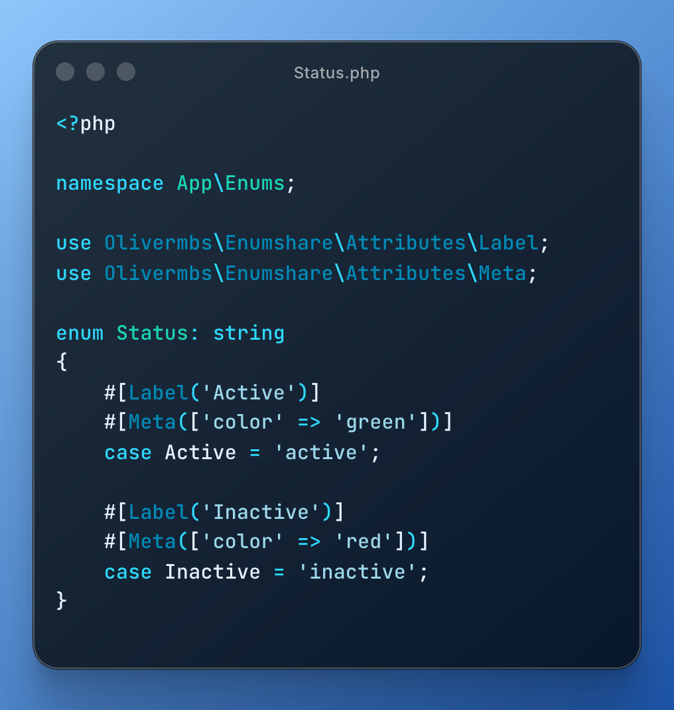
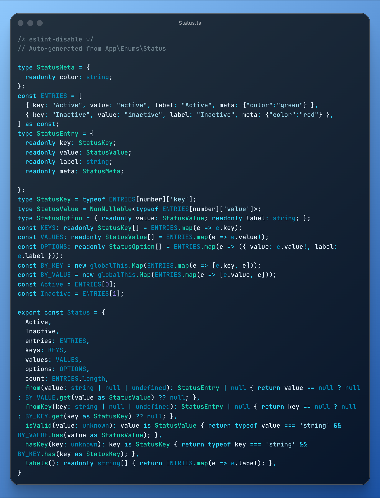
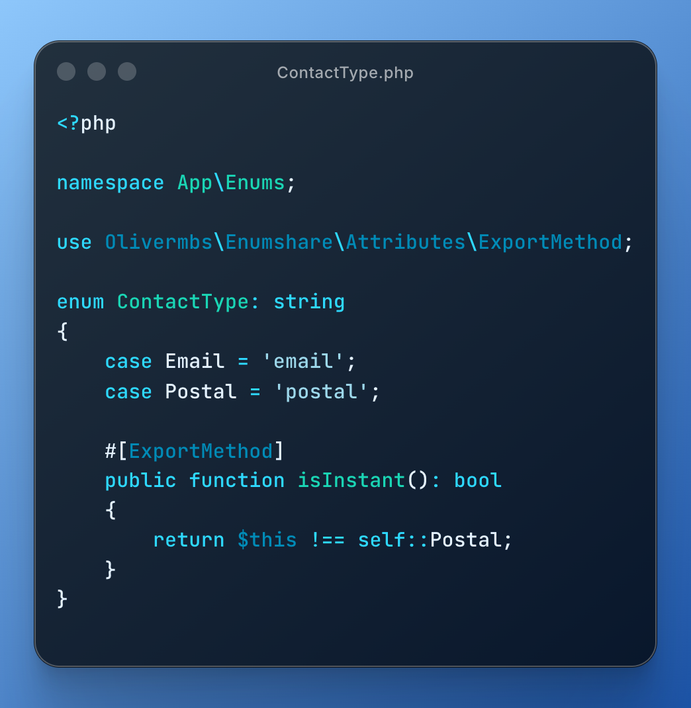
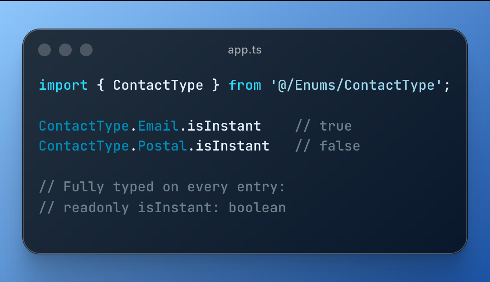

# Enumshare

[](https://packagist.org/packages/olivermbs/enumshare)
[](https://github.com/olivermbs/enumshare/actions?query=workflow%3Arun-tests+branch%3Amain)

A Laravel package to export PHP Enums to TypeScript. Simple, type-safe, zero runtime dependencies.

## Installation

```bash
composer require olivermbs/enumshare
```

## Quick Start

### 1. Create your enum

```php
<?php

namespace App\Enums;

use Olivermbs\Enumshare\Attributes\Label;
use Olivermbs\Enumshare\Attributes\Meta;

enum Status: string
{
    #[Label('Active')]
    #[Meta(['color' => 'green'])]
    case Active = 'active';

    #[Label('Inactive')]
    #[Meta(['color' => 'red'])]
    case Inactive = 'inactive';
}
```

Any PHP enum can be exported - no trait required.

### 2. Export

```bash
php artisan enums:export
```

### 3. Use in TypeScript

```typescript
import { Status } from '@/Enums/Status';

Status.Active.value    // 'active'
Status.Active.label    // 'Active'
Status.Active.meta     // { color: 'green' }

Status.from('active')  // Status.Active entry
Status.isValid('active') // true
Status.options         // [{ value: 'active', label: 'Active' }, ...]
```

### Generated Output



**↓ Generates ↓**



## Output Modes

Configure the output mode in `config/enumshare.php`:

```php
'mode' => 'full',  // or 'minimal'
```

### Full (default)

Includes labels, meta, lookup maps, type guards, and utility methods.

### Minimal

Simple output - just values and types (~10 lines per enum):

```typescript
/* eslint-disable */
// Auto-generated from App\Enums\Status

export const Status = {
  Active: 'active',
  Inactive: 'inactive',
} as const;

export type Status = typeof Status[keyof typeof Status];
```

## Configuration

```bash
php artisan vendor:publish --tag="enumshare-config"
```

```php
// config/enumshare.php
return [
    'enums' => [
        App\Enums\Status::class,
    ],
    'path' => resource_path('js/Enums'),
    'mode' => 'full',  // 'full' or 'minimal'
    'index' => false,  // Generate index.ts on every export
    'auto_discovery' => true,
    'auto_paths' => ['app/Enums'],
];
```

## Commands

```bash
php artisan enums:export              # Export enums
php artisan enums:export --force      # Rewrite all, even if unchanged
php artisan enums:export --list       # List enums that would be exported
php artisan enums:export --index      # Generate barrel index file
php artisan enums:export --prune      # Delete stale generated files
php artisan enums:export --check      # Verify generated files are up to date
php artisan enums:export --types      # Export TypeScript helper types
php artisan enums:export --path=...   # Override export path
php artisan enums:export --locale=... # Override locale for labels
```

`php artisan about` shows an Enumshare section with the active configuration.

## CI: Fail on Drift

`--check` verifies the generated files without writing anything and exits non-zero when
any file is stale or missing — so enum drift becomes a failing build instead of a runtime
surprise:

```yaml
# .github/workflows/ci.yml
- name: Check exported enums are up to date
  run: php artisan enums:export --check
```

It also lists orphaned files (generated for enums that no longer exist); clean those up
locally with `enums:export --prune`, which only ever deletes files carrying the
auto-generated marker.

## Attributes

| Attribute | Description |
|-----------|-------------|
| `#[Label('Text')]` | Static label |
| `#[TranslatedLabel('key')]` | Translation key |
| `#[Meta(['key' => 'value'])]` | Metadata |
| `#[ExportMethod]` | Export method result |
| `#[DontExport]` | Exclude enum from export |

**Note:** Enums are keyed by short name (class basename). Duplicate names across namespaces will cause a collision error.

### Computed properties with `#[ExportMethod]`

Mark any parameterless public method with `#[ExportMethod]` and its per-case result is
exported as a typed property on every entry:



**↓ Use it in TypeScript ↓**



### Keeping enums backend-only

Auto-discovery exports **every** enum in the configured paths. Mark internal enums with
`#[DontExport]` and they are excluded everywhere — the attribute wins even when the enum
is listed explicitly in the config (you get a warning about the conflict).

## Multilingual Labels

Add locales to the config and `#[TranslatedLabel]` labels are exported for every locale:

```php
'locales' => ['en', 'de'],
```

Each label becomes an object keyed by locale (`{ en: 'Active', de: 'Aktiv' }`), and the
generated file includes a resolver — `Status.labels('de')` returns the German labels,
while each entry keeps the full label object for custom handling.

## Auto-Regeneration with Vite

For automatic regeneration during development, install [Laravel Wayfinder](https://github.com/laravel/wayfinder):

```bash
composer require laravel/wayfinder
npm install @laravel/vite-plugin-wayfinder
```

Then configure Vite to watch your enum files:

```javascript
// vite.config.js
import { wayfinder } from '@laravel/vite-plugin-wayfinder';

export default defineConfig({
  plugins: [
    wayfinder({
      command: 'php artisan enums:export --force',
      patterns: ['app/Enums/**/*.php', 'lang/**/*.php', 'config/enumshare.php'],
    }),
  ],
});
```

> **Note:** Wayfinder is optional - only needed for auto-regeneration. You can always run `php artisan enums:export` manually.

## Testing

```bash
composer test
```

## License

MIT
